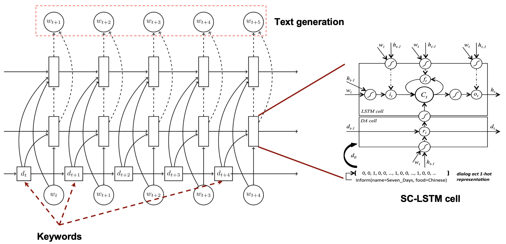
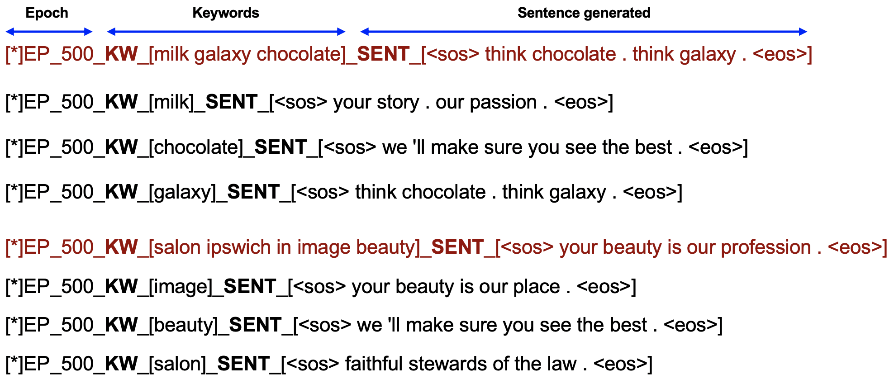

# SC-LSTM: Slogan generation
A Pytorch implementation of "Semantically Conditioned LSTM-based Natural Language Generation for Spoken Dialogue Systems" derived from the original tensorflow-version https://github.com/hit-computer/SC-LSTM.
The model is trained on Slogan-data to generate fancy slogans given a set of certain keywords.
Due to data shortage, the results might be overfitted, need more data to enhance the generalization.

## DataSet: Slogan data
- Pulling from http://www.textart.ru/database/slogan/list-advertising-slogans.html
- Pair of files: keyword file (TrainingData_Keywords.txt) vs. corresponding slogan (TrainingData_Text.txt)

## Preliminary:
- Download Glove pretrained word embedding
- For data preprocessing: python preprocessor/data_reader.py

## Train & eval:
- python main.py
- python eval.py

## Init results:

- Full keyword to slogan could be found [here](./result/sample.txt)
